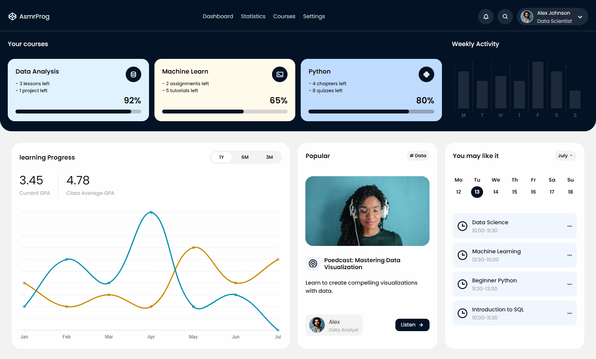

# React Dashboard Application

A responsive dashboard application built using React.js, focusing on reusable components and clean UI design.

## 🚀 Features
- Dashboard layout with cards and charts
- Reusable React components
- Responsive design
- Clean folder structure

## 🛠️ Tech Stack
- React.js
- JavaScript (ES6)
- HTML
- CSS
- Chart library (if any)

## 🌐 Live Demo
https://react-dashboard-six-theta.vercel.app/

## 📸 Screenshots

## 📦 How to Run Locally
1. Clone the repo
2. cd client
3. npm install
4. npm start

## 💡 What I Learned
- Component-based architecture in React
- State management basics
- Building dashboards using React

